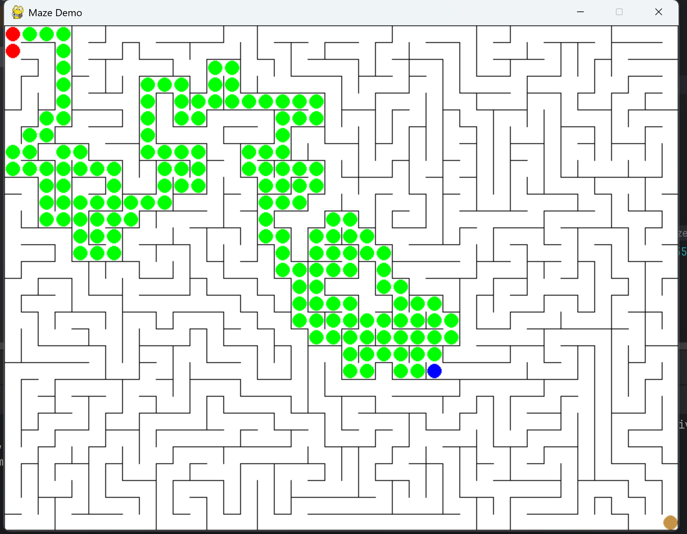
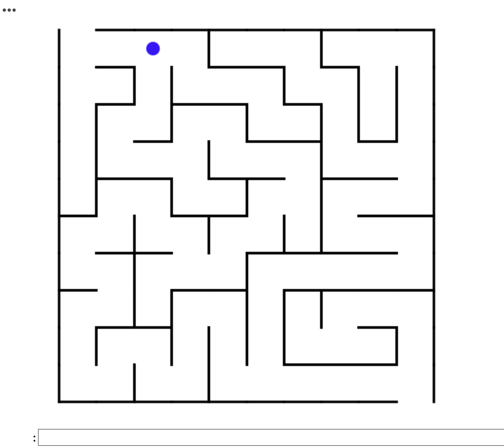

# Selecting Maze Game:

Initially, the plan was to use an existing, open source maze game running on the pygame library since it would be easy to integrate into a Jupyter Notebook running Python. A game called [PyMaze](https://www.pygame.org/project/733) was found, downloaded, and tested in PyCharm to ensure that it could run properly and handle user inputs.

When the game was transferred to a Jupyter Notebook in Google Colab, a major issue was discovered. The pygame library cannot run properly on the web interface of the Jupyter Notebooks and can only create game displays when running on the local machine. To solve this issue, the idea of using the pygame library was abandoned and the new goal was to generate a maze and player point that could be displayed as a graph in the Notebook using pyplot. A public Colab Notebook tutorial for [making and solving mazes](https://colab.research.google.com/github/norvig/pytudes/blob/main/ipynb/Maze.ipynb#scrollTo=TjIhUMKIr4HC) was found and the code for randomly generating mazes and displaying them was taken to generate and show the maze for the game. From there, a player class was created that could link to the maze and store the player's position. Both the player and the maze could then be plotted on the same graph and shown to the user every time the player's position updates. A move funtion was developed to use the maze walls to check for valid moves and update the player's position if the move is legal.

These functions were combined in a test Notebook (GameAttempt2.ipynb) with an infinite loop serving as the main method. In this loop, the maze and player are displayed, the user is prompted to enter a move (a letter 'l', 'r', 'u', or 'd'), the user input is processed, and the display is cleared for the next iteration. With this implementation the user is able to move step by step through the maze, one direction at a time, which also provides a simpler interface with the word recognition model that will later be used to control it. The resulting new game interface is shown below:

# Training a DS-CNN Model:
The initial training and testing of the model was done externally from the board in a Google Colab notebook. The Tensorflow and Pydub libraries were used to bring in the voice command data, train the mode, and export the finished model as a .tflite that could be used to run inference on the FPGA itself. The following images show the Colab code used to define, train, and export the model.

# Collecting Audio:
The code to interface with the onboard microphone for the PYNQ-Z1 board was found in the pre-loaded Jupyter Notebooks from the image processing lab. Inside the "jupyter_notebooks/base/audio" folder there is a notebook called audio_playback which is provided in the repository. Code from this file as well as code from board_btns_leds was taken and modified for our audio collection needs. The code for collecting and exporting the voice commands is shown below and the full notebook is included in the repository. The audio used to train the DS-CNN model must be in PCM form, while the PYNQ board and the onboard microphone collect and store audio in the PDM form. Before exporting the recorded audio as a CSV file, it is converted to the proper format by decimation.

# Loading Audio and Running Inference:
Due to verison and compatibility problems, the tensorflow library was never successfully run on the FPGA board. This required the audio to be exported and then loaded into another notebook for inference/keyword detection. The blocks of code to load in the pre-trained model and run inference on an audio sample are shown below. These are part of the pull speechCommand implementation. The audio inference demo provides real examples of audio sampled being tested on the trained model.

# Running Game on FPGA:
Finally, the game and its controls were transferred to run on the PYNQ-Z1 board. This is illustrated in the maze game demo video.

<video width="500" height="500" controls>
  <source src="maze_game_demo.mp4" type="video/mp4">
</video>
