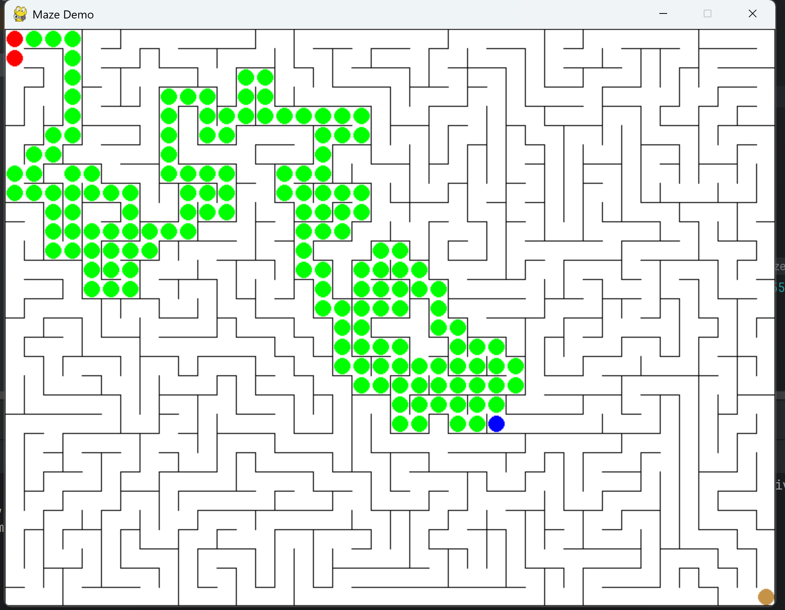

# Selecting Maze Game:

Initially, the plan was to use an existing, open source maze game running on the pygame library since it would be easy to integrate into a Jupyter Notebook running Python. A game called [PyMaze](https://www.pygame.org/project/733) was found, downloaded, and tested in Pycharm to ensure that it could run properly and handle user inputs.

When the game was transferred to a Jupyter Notebook in Google Colab, a major issue was discovered. The pygame library cannot run properly on the web interface of the Jupyter Notebooks and can only create the game displays when running on the local machine. To solve this issue, the idea of using the pygame library was abandoned and the new goal was to generate a maze and player point that could be displayed as a graph in the Notebook using pyplot. A public Colab Notebook tutorial for [making and solving mazes](https://colab.research.google.com/github/norvig/pytudes/blob/main/ipynb/Maze.ipynb#scrollTo=TjIhUMKIr4HC) was found and the code for randomly generating mazes and displaying them was taken to generate and show the maze for the game. From there, a player class was created that could link to the maze and store the player's position. Both the player and the maze could then be plotted on the same graph and shown to the user every time the player's position updates. A move funtion was developed to use the maze walls to check for valid moves and update the player's position if the move is legal.

These functions were combined in a test Notebook (GameAttempt2.ipynb) with an infinite loop serving as the main method. In this loop, the maze and player are displayed, the user is prompted to enter a move (a letter 'l', 'r', 'u', or 'd'), the user input is processed, and the display is cleared for the next iteration. With this implementation the user is able to move step by step through the maze, one direction at a time, which also provides a simpler interface with the word recognition model that will later be used to control it. The resulting new game interface is shown below:

